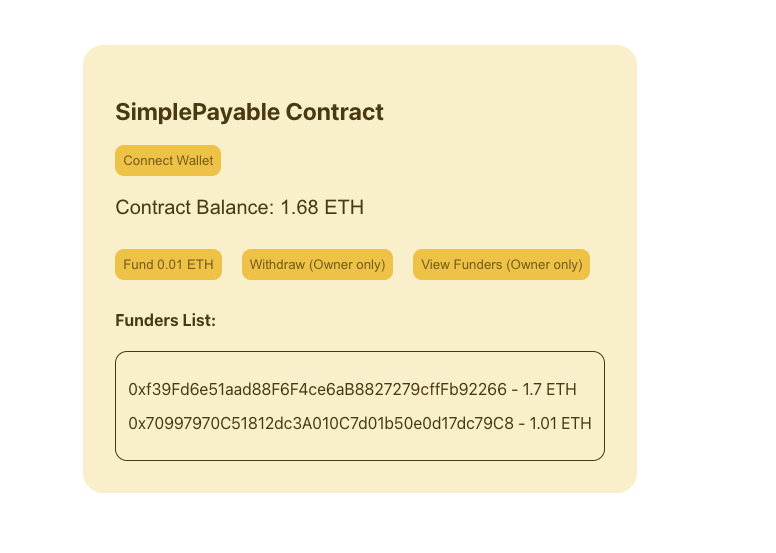

# Simple DeFi App

FRONT END REPO: https://github.com/umashankar-tech/Simple-Defi-Dapp-Frontend

This project demonstrates a simple DeFi smart contract workflow using [Foundry](https://book.getfoundry.sh/), including local deployment with Anvil and integration with a React frontend.

## Features


- **Solidity Smart Contract:** `SimplePayableAndWithdrawal.sol` for basic payable and withdrawal functionality.
- **Testing:** Comprehensive tests using Forge.
- **Local Blockchain:** Anvil for local development and testing.
- **Deployment Scripts:** Automated deployment with Forge scripts.
- **Frontend Integration:** Designed for easy ABI and address export to React apps.

---

## Getting Started

### Prerequisites

- [Foundry](https://book.getfoundry.sh/getting-started/installation.html) (includes Forge & Anvil)
- Node.js (for React frontend)

### Build & Test

```sh
forge build
forge test
```

### Run Local Blockchain

```sh
anvil
```

### Deploy Contract

```sh
forge script script/DeploySimplePayableAndWithdrawal.s.sol --rpc-url http://127.0.0.1:8545 --private-key <your_private_key> --broadcast
```

### Get ABI for Frontend

After deployment, the ABI is generated at:
```
out/SimplePayableAndWithdrawal.sol/SimplePayableAndWithdrawal.json
```
Copy the `"abi"` section from this file for use in your React app.

#### Example: Using ABI in React

```js
import contractAbi from './abi/SimplePayableAndWithdrawal.json';
// Use contractAbi.abi with ethers.js or web3.js
```

---

## Project Structure

- `src/` – Solidity contracts
- `script/` – Deployment scripts
- `test/` – Contract tests
- `out/` – Build artifacts (including ABI)
- `broadcast/` – Deployment logs

---

## Resources

- [Foundry Book](https://book.getfoundry.sh/)
- [Ethers.js Docs](https://docs.ethers.org/)
- [React](https://react.dev/)

---

